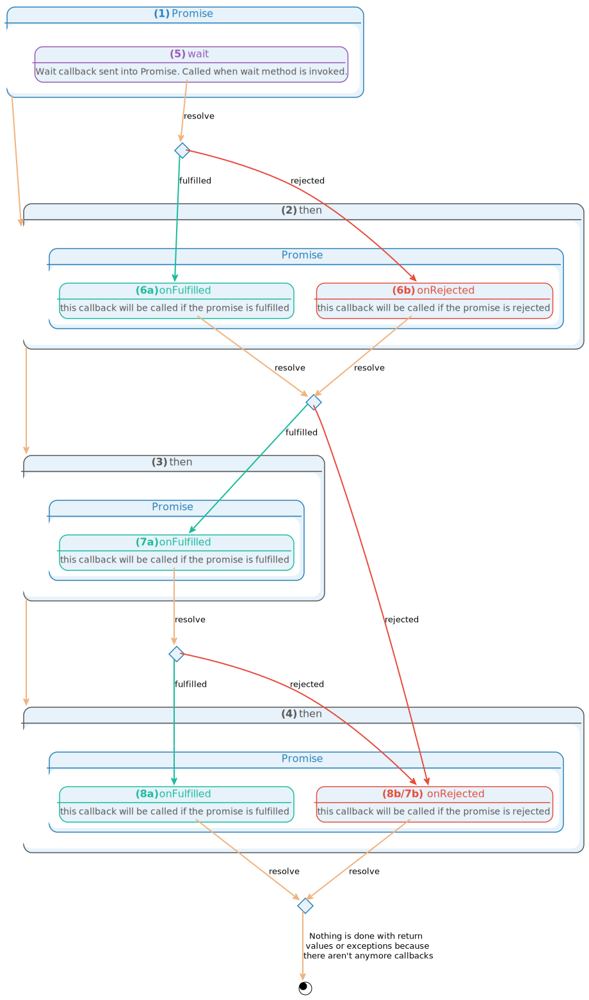

========
Promises
========

The purpose of this document is to provide details about the |ASB|'s
use of promises. A general overview of what promises are is provided but a more
detailed understanding of promises as a whole is left up to the reader.

Below is some useful documentation related to promises and how Guzzle uses them:

 * `Guzzle/Promises`_
 * `You're Missing The Point Of Promises`_
 * `Promises A+ Spec`_
 * `AWS Promises Overview`_

.. _Guzzle/Promises: https://github.com/guzzle/promises
.. _You're Missing The Point Of Promises: https://blog.domenic.me/youre-missing-the-point-of-promises/
.. _Promises A+ Spec: https://promisesaplus.com/
.. _AWS Promises Overview: https://docs.aws.amazon.com/sdk-for-php/v3/developer-guide/guide_promises.html

Introduction
------------

According to the Guzzle/Promises documentation:

 | A promise represents the eventual result of an asynchronous operation. The
 | primary way of interacting with a ``Promise`` is through its ``then`` method,
 | which registers callbacks to receive either a promise's eventual value or the
 | reason why the promise cannot be fulfilled.

The idea behind promises is to create a chain-able list of operations to occur
where, at any time in the chain, the operation can be rejected. Each "link" in
the "chain" is a ``Promise`` which accepts a value, does something with it, and
then, if successful, returns a value or rejects the promise with a reason.

A rejection can occur either by throwing an exception or explicitly calling the
promise's ``reject`` method. The chain is linked together by ``then`` methods
which accept a ``fulfilled`` callback or a ``reject`` callback.

.. _example-flow:

Example Flow
------------

See the example flow below for possible paths through a set of example promises.

As you can see above, the primary way of interacting with a promise is through
its ``then`` method **(2-4)**, which registers callbacks **(6-8)** to receive
either a promise's eventual value or the reason why the promise cannot be
fulfilled. The first argument to ``then`` is the ``onFulfilled`` callback
**(6a, 7a, 8a)**; the second is ``onRejected`` **(6b, 7b/8b)**.

After constructing our ``Promise`` **(1)**, we call ``then`` multiple times
**(2-4)** so we can chain the promises together. The ``Promise`` chain is not
begun until the ``wait`` method **(5)**  is called. The ``wait`` method performs
some initial work and MUST resolve the Promise.

*Resolving* a promise means you either fulfill a promise with a *value* or
reject a promise with a *reason*. Resolving a promises triggers callbacks
registered with the promise's ``then`` method. These callbacks are triggered
only once and in the order in which they were added.

.. note::

    If desired, you can specify an ``onCancel`` callback as the second parameter
    when constructing a ``Promise``. You can cancel a promise that has not yet
    been fulfilled using the ``cancel()`` method of the ``Promise``.

Once the ``wait`` method is called, it MUST resolve the ``Promise`` using the
``resolve($value)`` method. Resolving a promise with any value other than a
``GuzzleHttp\Promise\RejectedPromise`` will trigger all of the ``onFulfilled``
callbacks (resolving a promise with a rejected promise will reject the promise
and trigger the ``$onRejected`` callbacks).

We see two different resolution paths for our ``Promise`` **(1)** as expected.
The second promise's ``onFulfilled`` callback **(6a)** would receive the
returned value upon fulfillment. Upon rejection, the ``onRejected`` callback
**(6b)** would receive the value as it's reason. If an exception is thrown in
an ``$onRejected`` callback, subsequent ``$onRejected`` callbacks are invoked
with the thrown exception as the reason.

The example has been structured so our ``$onRejected`` callback **(6b)** has the
potential to handle the rejection gracefully. To do so, the ``$onRejected``
callback would return any non-rejected value and it would be passed on to the
next ``$onFulfilled`` callback **(7a)**. Likewise, our ``$onFulfilled`` callback
can return any non-rejected value and it would be passed on to the next
``$onFulfilled`` callback **(7a)**.

You'll notice, it's also possible for both of these callbacks to return a
rejected value or throw an exception. However, the next ``Promise`` in line does
not have an ``$onRejected`` callback. In this case, flow would move to the next
``Promise`` with an ``$onRejected`` callback **(7b)**.

If the ``$onFulfilled`` callback **(7a)** was called, it could also fulfill or
reject the promise. If it returns a non-rejected value, the next
``$onFulfilled`` method would be invoked **(8a)**. Or, if a rejected value was
returned (or an exception was encountered), flow would move to the
``$onRejected`` callback **(8b)**.

At this point the ``$onFulfilled`` and ``$onRejected`` callbacks at the end of
the chain are invoked. If the final reason of a rejection is an instance of
``\Exception``, the reason is thrown. Otherwise, a
``GuzzleHttp\Promise\RejectionException`` is thrown and the reason can be
obtained by calling the ``getReason`` method of the exception.

Upon fulfillment, the final value returned from ``$onFulfilled`` **(8a)** is
returned as the value from calling ``wait`` **(5)** on our initial ``Promise``.

Code Example
------------

The function below mimics the :ref:`example-flow` above. We will use this method
to demonstrate the different ways a promise can be resolved (
:ref:`resolving-directly-example` and :ref:`resolve-by-waiting-example`).

.. code-block:: php
    :linenos:

    function setPromiseChain(\GuzzleHttp\Promise\PromiseInterface &$promise) {
        //Additional promises added to the original promise to form a "chain".
        $promise->then(
            //This is an onFulfilled callback handler. Since it is the first
            //one, it will receive the resolved value from the original
            //promise's wait method.
            function ($value) {
                if ($value === '1') {
                    return '1.1';
                }

                if ($value === '2') {
                    //In this case, we'll return a promise set to automatically
                    //be rejected. This will cause the next onRejected handler
                    //to be run.
                    return new \GuzzleHttp\Promise\RejectedPromise('2.1');
                }

                if ($value === '3') {
                    return '3.1';
                }
            },
            static function ($reason) {
                if ($reason === '4') {
                    //We can continue the rejection chain by returning another
                    //rejected promise.
                    return new \GuzzleHttp\Promise\RejectedPromise('4.1');
                }

                if (
                    $reason instanceof \Exception
                    && $reason->getMessage() === '6'
                ) {
                    //Returning a non-rejected value here causes our promise to
                    //resume using the onFulfilled handlers.
                    return $reason->getMessage() . '.1';
                }

                //5 - No return value here will make the value null
            }
        )->then(
            function ($value) {
                //The values returned below are non-rejected values; they will
                //be passed on to the next onFulfilled method.
                if ($value === '1.1') {
                    return '1.2';
                }

                if ($value === '6.1') {
                    return '6.2';
                }

                if (null === $value) {
                    return '5.1';
                }

                //3.1 - In this case, we decide to return a rejected promise.
                //Execution will go to the next onRejected handler.
                return new \GuzzleHttp\Promise\RejectedPromise('3.2');
            }
        )->then(
            //The two handlers sent into this `then` method are the last in
            //the chain. Return values are ignored since there aren't any
            //handlers to accept the values. Echo is used to show the final
            //execution endpoint.
            static function ($value) {
                if ($value === '1.2') {
                    echo '1.3';
                } else if ($value === '6.2') {
                    echo '6.3';
                    //Returning here does nothing because there aren't anymore
                    //handlers below.
                    return '6.4';
                }

                //Nothing to do for 5.1
            },
            function ($reason) {
                if ($reason === '3.2') {
                    //It's ok, let's recover!
                    echo '3.3';
                } elseif ($reason === '2.1') {
                    echo '2.2';
                } elseif ($reason === '4.1') {
                    echo '4.2';
                    //Throwing an exception here will do nothing. This promise
                    //will take the message of the exception and pass it on
                    //as the reason. However, without another onRejected handler
                    //after it, it's just swallowed.
                    throw new \Exception('4.3');
                } else {
                    echo $reason;
                }
            }
        );
    }

.. _resolving-directly-example:

Resolving Directly
==================

The following example shows a new ``Promise`` being constructed, having the
promise chain added, and then resolving the ``Promise`` directly using the
``resolve`` method.

Each call to ``resolve`` would need to be made in different executions since
a ``Promise`` can only be resolved once.

.. code-block:: php
    :linenos:

    $promise = new \GuzzleHttp\Promise\Promise();

    setPromiseChain($promise);

    $promise->resolve('1');

    //Output: 1.3
    //Promise resolution value: 1

    $promise->resolve('2');

    //Output: 2.2
    //Promise resolution value: 2

    $promise->resolve('3');

    //Output: 3.3
    //Promise resolution value: 3

    $promise->reject('4');

    //Output: 4.2
    //
    //  [GuzzleHttp\Promise\RejectionException]
    //  The promise was rejected with reason: 4

    $promise->reject('5');
    //No output
    //Promise resolution value: 5

.. _resolve-by-waiting-example:

Resolving By Waiting
====================

The following ``Promise`` is created with a ``wait`` method. Resolved values are
passed on to the ``onFulfilled`` handlers, rejected values are passed on to
``onRejected`` handlers. The ``wait`` method MUST be called on the ``Promise``
for it to start execution.

.. code-block:: php
    :linenos:

    $promise = new \GuzzleHttp\Promise\Promise(
        //Note the use of &$promise. Guzzle currently doesn't send in the
        //promise to its wait function so we can't resolve/reject it unless
        //we send it in by reference.
        static function() use (&$promise) {
            //Pick a single line below and uncomment it to see different
            //paths through the promise chain. 1-5 have been shown already;
            //we'll focus on 6.

            //$promise->resolve('1');
            //$promise->resolve('2');
            //$promise->resolve('3');
            //$promise->reject('4');
            //$promise->reject('5');

            //Throwing an exception is the same as rejecting
            throw new \Exception('6');
        }
    );

    setPromiseChain($promise);

    $promise->wait();

    //Output: 6.3
    //
    //  [Exception]
    //  6

ApiServiceBundle Promise
------------------------

Guzzle's ``Promise`` class provides all of the functionality you'd need to work
with promises. However, the |ASB| provides a ``Promise`` utility
class (:class:`Promise`) that makes it even easier.

async
=====

As you can see above in :ref:`resolve-by-waiting-example`, when creating a
``wait`` method for a ``Promise``, you have to send in the ``$promise`` variable
as a reference to resolve the promise. After a while, this can clutter up your
code. The :meth:`Promise::async` method makes it easy to provide a callback
whose return value will be used as a promise's resolution value so operations
can be bundled together.

.. code-block:: php
    :linenos:

    use Cob\Bundle\ApiServicesBundle\Models\Util\Promise;

    //Some operation we want to prepare but not run until later
    $promise = Promise::async(static function () {
        // ...
        $promise2 = Promise::async(static function () {
            return 'inner';
        });

        return 'outter/' . $promise2->wait();
    });

    //Let's run our promise now
    echo $promise->wait(); //outter/inner

Without the :meth:`Promise::async` helper, the code above would look like this:

.. code-block:: php
    :linenos:

    use \GuzzleHttp\Promise\Promise;

    //Some operation we want to prepare but not run until later
    $promise = new Promise(function () use (&$promise) {
        // ...
        $promise2 = new Promise(function () use (&$promise2) {
            $promise2->resolve('inner');
        });

        $promise->resolve('outter/' . $promise2->wait());
    });

    //Let's run our promise now
    echo $promise->wait();

As you can see, the code is a bit cleaner and easier to understand.

all
===

Guzzle provides a lot of `helper methods`_ you can use to create aggregate sets
of promises. The |ASB| provides :meth:`Promise::all` which accepts an
``array`` of promises, and returns an aggregate promise.

Calling ``wait`` on the returned aggregate ``Promise`` causes all promises it
contains to be waited on concurrently (25 at a time by default).

If a promise is rejected, the aggregate promise is rejected with the encountered
rejection. This makes it so the aggregate ``Promise`` must fulfill all of the
inner promises to be considered fulfilled.

.. _helper methods: https://docs.aws.amazon.com/aws-sdk-php/v3/api/namespace-GuzzleHttp.Promise.html

.. warning::

    When running promises as a part of an aggregate, you cannot be certain of
    the order the promises will be resolved. The async nature of the promises
    makes it so any ``Promise`` can be fulfilled or rejected at any time in
    the event loop.

For example, let's assume we've compiled a list of 1,000 promises which fetch a
file from an API endpoint and we want to run these promises concurrently instead
of one at a time. The following code would attempt to resolve all of the
promises (25 at a time).

.. code-block:: php
    :linenos:

    use Cob\Bundle\ApiServicesBundle\Models\Util\Promise;

    $promises = [...]; //An array filled with promises to wait on

    $aggregate = Promise::all($promises)->then(
        function () {
            echo 'All done!';
        },
        function ($reason) {
            echo 'Uh oh, there was an error!'
        }
    );

    $aggregate->wait(); //All done!

Assuming one of the promises we send in is rejected, an exception is thrown with
the reason:

.. code-block:: php
    :linenos:

    use Cob\Bundle\ApiServicesBundle\Models\Util\Promise;

    $promise = Promise::async(static function () {
        return 'promise1';
    });

    $promise2 = Promise::async(static function () {
        throw new \Exception('uh oh!');
    });

    try {
        $aggregate = Promise::all([$promise, $promise2])->then(
            static function () {
                echo 'all done!';
            }
            //We don't use an onRejected callback in this example
            //but we could if we wanted to catch the exception
            //thrown and do something with it.
        );

        echo $aggregate->wait(); //Exception: uh oh!
    } catch (\Exception $e) {
        echo $e->getMessage();
    }

In addition, the :meth:`Promise::all` method accepts other parameters. Below, we
provide the number of concurrent runs we want, a message used as context, and a
|ServiceClient|.

The |ServiceClient| dispatches events before all promises are resolved, after
each promise is resolved, and after all promises are resolved. The context
message is given to the event dispatched after a single promise is fulfilled;
this makes it easy to use the events as a way of displaying the aggregate's
progress.

.. code-block:: php
    :linenos:

    use Cob\Bundle\ApiServicesBundle\Models\Util\Promise;

    $promises = [...]; //An array filled with promises to wait on

    $aggregate = Promise::all(
        $promises,
        25, //run up to 25 promises at a time
        'Running Promises', //provide context to this operation
        $this->getClient() //ServiceClient to dispatch events
    )->then(
        function () {
            echo 'All done!';
        },
        function ($reason) {
            echo 'Uh oh, there was an error!'
        }
    );

    //Events are dispatched within since a ServiceClient was provided
    //and up to 25 promises are run at a time.
    $aggregate->wait(); //All done!
